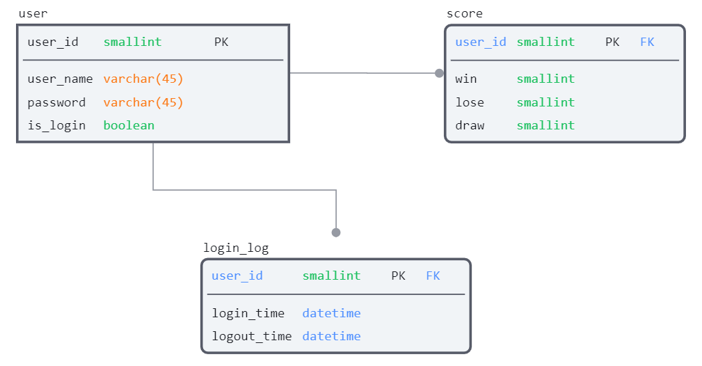

# 적당한 타이틀

## 00. 팀원 소개
- 팀원을 소개하는 중

## 01. 기술 스택
- 자바랑 SQL을 사용한 엄청난 기술력 바탕

## 02. 프로젝트 주제
- 이 프로젝트는 어쩌고 저쩌고 엄청난 프로젝트.

## 03. 도메인 관련 용어
- 🎮 게임 (game)
    1. 규칙을 정해 놓고 승부를 겨루는 놀이. 순화어는 `놀이`, `내기`.
    2. 특히, 운동 경기를 이르는 말. 순화어는 `경기`.
- ✌️ 가위 (scissors) : 보를 이기고 바위에게 진다.
- ✊ 바위 (rock) : 가위를 이기고 보에게 진다.
- 🖐️ 보 (paper) : 바위를 이기고 바위에게 진다.
- 🏆 랭킹 (ranking) : 순위. 능력이나 지위에 따라 매겨지거나 정해진 순서

## 04. 기능 명세
- 기능 명세서를 작성하는 중

## 05. ERD (Entity Relationship Diagram)

- 멋진 설명을 추가하는 공간.

## 06. 트러블 슈팅
- 완벽한 코드라서 그냥 되버림. ㄷㄷ;

## 07. 느낀 점
- 느낀점을 적는 곳

## 08. 리펙토링 및 컨벤션 체크
- Do my BEST.